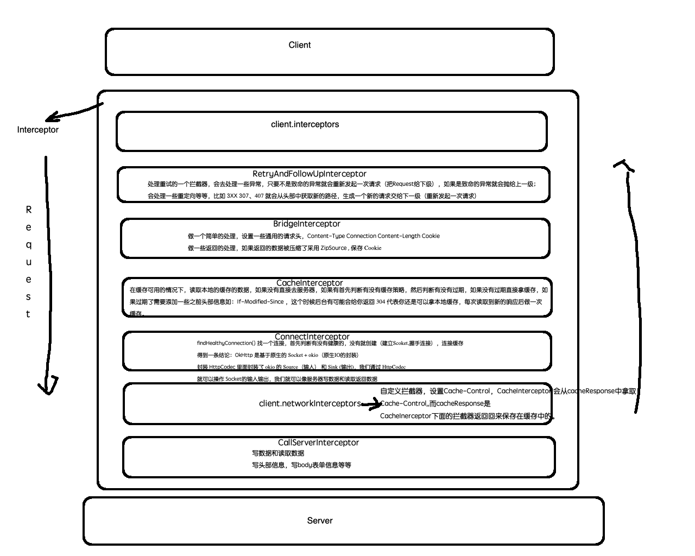

@[TOC]（上传进度监听和自定义缓存)


## 文件上传进度监听
从源码的角度去解决（本质），用，扩展，出了问题  
request.body().writeTo(bufferedRequestBody);// 往服务器写数据  
MultipartBody.writeTo() 方法去写数据 ，怎么做监听？思路，contentLength , 还需要知道写了多少  

1. 文件上传的具体一些细节（CallServerInterceptor）
2. 静态代理的设计模式

## 自定义缓存（要求：有网 30s 内请求读缓存，无网直接读缓存）
只会缓存 get请求的数据



<font size=5 color=red>为什么过期时间需要设置在NetWorkInterceptor中</font>

``` 
第一次保存缓存
 networkResponse = chain.proceed(networkRequest)
 ...
  val response = networkResponse!!.newBuilder()
        .cacheResponse(stripBody(cacheResponse))
        .networkResponse(stripBody(networkResponse))
        .build()

    if (cache != null) {
      if (response.promisesBody() && CacheStrategy.isCacheable(response, networkRequest)) {
        // Offer this request to the cache.
        //保存CacheInterceptor下面拦截器返回的response到缓存中
        val cacheRequest = cache.put(response)
        return cacheWritingResponse(cacheRequest, response)
      }

      if (HttpMethod.invalidatesCache(networkRequest.method)) {
        try {
          cache.remove(networkRequest)
        } catch (_: IOException) {
          // The cache cannot be written.
        }
      }
    }
    
    
 第二次请求拿去缓存
 
 CacheStrategy中  computeCandidate()
 
 //如果是在client.interceptors中设置的过期时间，这个过期时间就不会被保存到缓存中
 val responseCaching = cacheResponse.cacheControl
```


// 这行代码 ，<font size=5 color=red>client.interceptors</font> 中设置没网的时候直接去缓存中拿会走以下方法  

```
if (!responseCaching.noCache() && ageMillis + minFreshMillis < freshMillis + maxStaleMillis) {
  // 缓存过期策略，noCache() true , ageMillis + minFreshMillis < freshMillis + maxStaleMillis  （false） 还是进来了 
  return new CacheStrategy(null, builder.build());
}
```

1.缓存的 CacheInterceptor 数据，拦截器


 


      
     
 

