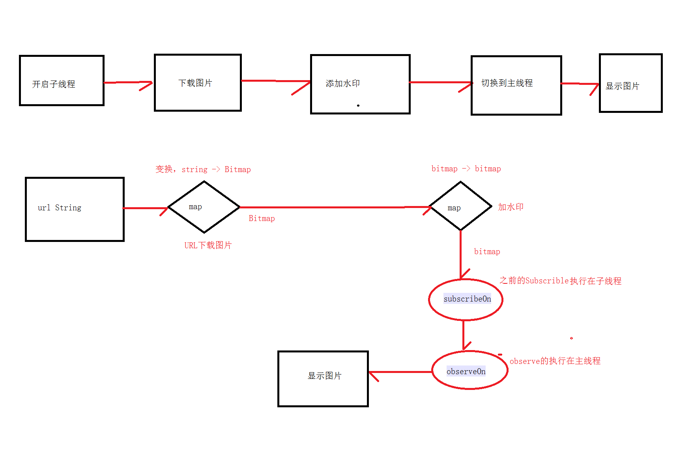

@[TOC]（第三方开源库 RXJava - 基本使用和源码分析)


## [RxJava学习文章](http://www.jianshu.com/p/464fa025229e)

## 流程：



## 代码：

``` 
class Rxjava1Activity : AppCompatActivity() {

    override fun onCreate(savedInstanceState: Bundle?) {
        super.onCreate(savedInstanceState)
        setContentView(R.layout.activity_rxjava1)

        Observable.just("http://img.taopic.com/uploads/allimg/130331/240460-13033106243430.jpg")
            //String 转 bitmap
            .map {
                var url = URL(it)
                var connection = url.openConnection() as HttpURLConnection
                val inputStream = connection.inputStream
                BitmapFactory.decodeStream(inputStream)
            }
            //bitmap 转 bitmap
            .map {
                //加个水印
                createWatermark(it,"Rxjava")
            }
            .subscribeOn(Schedulers.io())  //之前的Subscribe变化都执行在子线程
            .observeOn(AndroidSchedulers.mainThread())//obser观察者执行在主线程
            .subscribe {
                iv.setImageBitmap(it)
            }
    }

    /**
     * 加水印
     */
    fun createWatermark(bitmap: Bitmap, mark: String) :Bitmap{
        var w = bitmap.width
        var h = bitmap.height
        var bmp = Bitmap.createBitmap(w,h,Bitmap.Config.ARGB_8888)
        var canvas = Canvas(bmp)
        var paint = Paint()
        // 水印颜色
        paint.color = Color.parseColor("#C5FF0000")
        // 水印字体大小
        paint.textSize = 150f
        //抗锯齿
        paint.isAntiAlias = true
        canvas.drawBitmap(bitmap,0f,0f,paint)

        //文字的边界
        var bounds = Rect()
        paint.getTextBounds(mark,0,mark.length,bounds)

        val fontMetrics = paint.fontMetrics
        var dy = (fontMetrics.bottom-fontMetrics.top)/2-fontMetrics.bottom
        var baseline = h-bounds.height()/2 +dy
        //绘制文字
        canvas.drawText(mark, (w-bounds.width()).toFloat(),baseline,paint)
        return bmp
    }
}
```


 


      
     
 

