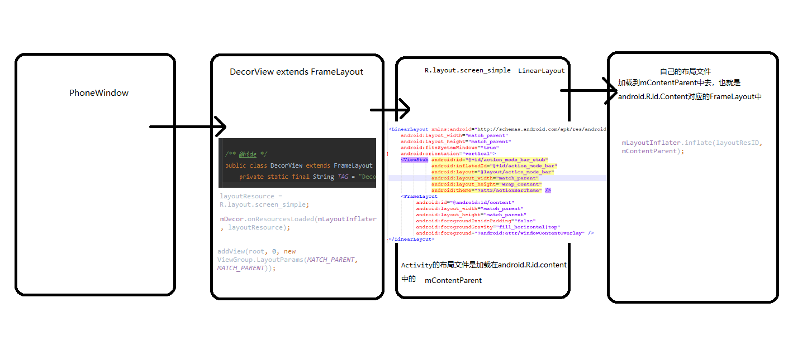
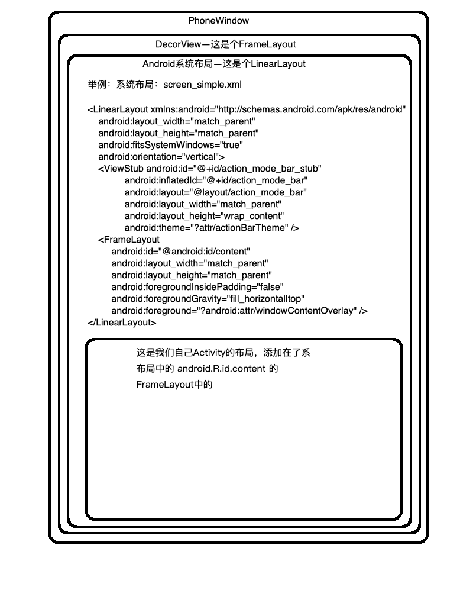

@[TOC](Activity.setContentView源码)

## 首先用一张图来描述下:



## 源码分析

```
    `android.app.Activity`.setContentView(@LayoutRes int layoutResID) {
        //先看看getWindow是什么
        getWindow().setContentView(layoutResID);
        initWindowDecorActionBar();
    }
    ->  `android.app.Activity`.getWindow(){
        return mWindow;
    }
    -> `android.app.Activity`.attach(Context context, ActivityThread aThread,
            Instrumentation instr, IBinder token, int ident,
            Application application, Intent intent, ActivityInfo info,
            CharSequence title, Activity parent, String id,
            NonConfigurationInstances lastNonConfigurationInstances,
            Configuration config, String referrer, IVoiceInteractor voiceInteractor,
            Window window, ActivityConfigCallback activityConfigCallback, IBinder assistToken) {
        
        ...
        mWindow = new PhoneWindow(this, window, activityConfigCallback);
    }
    
    //也就是调用的`PhoneWindow`的`setContentView`方法
    
    -> `com.android.internal.policy.PhoneWindow`.setContentView(int layoutResID){
        
        if (mContentParent == null) {
            // 如果mContentParent 为Null 则需要创建
            installDecor();
        } else if (!hasFeature(FEATURE_CONTENT_TRANSITIONS)) {
            mContentParent.removeAllViews();
        }

        if (hasFeature(FEATURE_CONTENT_TRANSITIONS)) {
            final Scene newScene = Scene.getSceneForLayout(mContentParent, layoutResID,
                    getContext());
            transitionTo(newScene);
        } else {
        
            // 看完后返回到这里,mContentView也就是加入到`DecorView`中的系统布局中id为 `android.R.id.content` 的 `FrameLayout` 
            // 这里将layoutResID创建出来的View添加进 `mContentParent`中
            mLayoutInflater.inflate(layoutResID, mContentParent);
        }
        
        ....
    }
    
    -> `com.android.internal.policy.PhoneWindow`.installDecor(){
         ...
        if (mDecor == null) {
            // 创建DecotrView
            mDecor = generateDecor(-1);
           ...
        } else {
            mDecor.setWindow(this);
        }
        if (mContentParent == null) {
            //创建mContentView
            mContentParent = generateLayout(mDecor);
            ...
         }
    }
    
    //先看创建DecotrView的方法
    
    -> `com.android.internal.policy.PhoneWindow`.generateDecor(int featureId) {
        ....
         return new DecorView(context, featureId, this, getAttributes());
    }
    
    public class DecorView extends FrameLayout
    
    DecorView是个FrameLayout
    
    //再看创建mContentParent的方法
    
     -> `com.android.internal.policy.PhoneWindow`.generateLayout(DecorView decor) {
        ...
        int layoutResource; //系统的布局
        ...
        //根据theme或者其它要求设置系统布局id
        } else if ((features & (1 << FEATURE_ACTION_MODE_OVERLAY)) != 0) {
            layoutResource = R.layout.screen_simple_overlay_action_mode;
        } else {
            layoutResource = R.layout.screen_simple;
        }
        
        ...
        //把系统的layoutResource 实例化的 View添加进DecorView中
        mDecor.onResourcesLoaded(mLayoutInflater, layoutResource);
        
        //找到在`DecorView`中,这时系统布局已经加入到了`DecorView`中所以相当于在系统布局中找到 `android.R.id.content` 也就是一个frameLayout
        ViewGroup contentParent = (ViewGroup)findViewById(ID_ANDROID_CONTENT);
        
        return contentParent
     }
     
     -> `com.android.internal.policy.DecorView`.onResourcesLoaded(LayoutInflater inflater, int layoutResource){
        ...
        final View root = inflater.inflate(layoutResource, null); //系统的布局是个LinearLayout
        ...
        //把系统的layoutResource 实例化的 View添加进DecorView中
        addView(root, 0, new ViewGroup.LayoutParams(MATCH_PARENT, MATCH_PARENT));
        ...
     }
     
```

## 这是Activity.setContentView布局框架图




 


      
     
 

