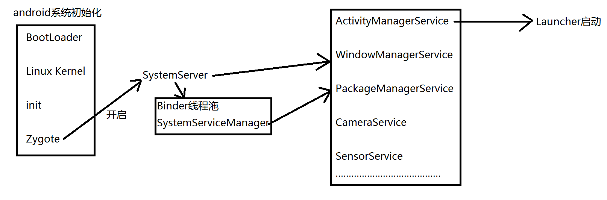
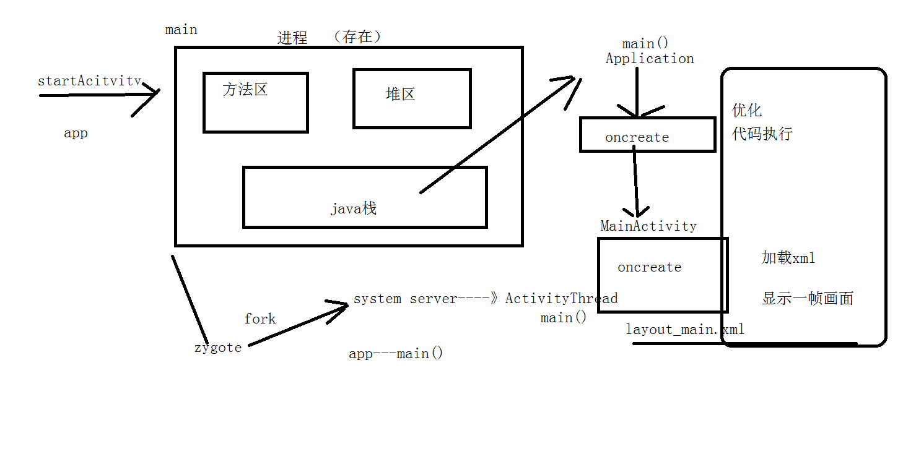

# 1.系统的启动

1. 打开电源  引导芯片代码加载引导程序Boot Loader到RAM中去执行
2. BootLoader把操作系统拉起来
3. Linux 内核启动开始系统设置，找到一个init.rc文件启动初始化进程
4. init进程初始化和启动属性服务，之后开启Zygote进程
5. Zygote开始创建JVM并注册JNI方法，开启SystemServer
6. 启动Binder线程沲和SystemServiceManager,并启动各种服务
7. AMS启动Launcher



# 2.Launcher启动应用程序


当我们用手点击一个图标时，就到了这个类`public final class Launcher extends Activity`,
类路径在`E:\tools\android-src\android-6.0.1_r1\packages\apps\Launcher2\src\com\android\launcher2\Launcher.java`

```
执行`onClick(View view)`方法，会把这个应用的相关信息传入  
先获取一个intent--->startActivitySafely(v, intent, tag)-->startActivity(v, intent, tag);-->startActivity(intent);
startActivity(intent)会开一个APP进程

ActivityThread.java的main方法作为入口     用attach开启app    再加载application和activity
thread.attach(false);--->mgr.attachApplication(mAppThread)会通过远端进程去回调private void handleBindApplication(AppBindData data)
Application app = data.info.makeApplication()----创建Application对象
mInstrumentation.callApplicationOnCreate(app);---- Application调用onCreate方法
```



# 3.adb一些命令说明

1. 通过`adb shell dumpsys activity activities`查看当前的activity名
2. 查看进程   `adb shell ps`

# 4.黑白屏问题

原因：

        在res/values/styles.xml文件中  
        白屏   `<style name="AppTheme" parent="Theme.AppCompat.Light">`
        黑屏   ` <style name="AppTheme">（在以前的老版本上有效，现在的版本默认使用透明处理了）`

伪解决办法：

        1.在自己的<style name="AppTheme" parent="Theme.AppCompat.Light">中加入windowsbackground，可用于打广告
        2.设置windowbackground为透明的  <item name="android:windowIsTranslucent">true</item>
        但这2种方法会有个问题，所有的activity启动都会显示
        3.单独做成一个主题
        <style name="AppTheme.Launcher">
                <item name="android:windowBackground">@drawable/bg</item>
        </style>
        再在功能清单中的单独activity下设置
        <activity
              android:theme="@style/AppTheme.Launcher"
        然后在程序中使用setTheme(R.style.AppTheme)
        让APP中所有的activity还是使用以前的样式，这样做就只有启动时才使用自己的样式

# 5.启动时间查看

4.4以前 `adb shell am start -W com.lqr.wechat/com.lqr.wechat.activity.SplashActivity`

    ThisTime:最后一个启动的Activity的启动耗时；
    TotalTime:自己的所有Activity的启动耗时；
    WaitTime: ActivityManagerService启动App的Activity时的总时间（包括当前Activity的onPause()和自己Activity的启动）

    AM路径：E:\tools\android-src\android-6.0.1_r1\frameworks\base\cmds\am\src\com\android\commands\am
    Am.java   946行开始打印启动时间信息
    其中一个result对象，在871行初始化 result = mAm.startActivityAndWait(。。。）
    在这个初始化时就已经进行了时间的计算：
    在android-src\android-6.0.1_r1\frameworks\base\services\core\java\com\android\server\am\ActivityRecord.java文件中计算
    void windowsDrawnLocked() --->reportLaunchTimeLocked(SystemClock.uptimeMillis())中完成时间的统计;

4.4版本以后Logcat输入`Display`筛选系统日志  `不过滤信息No Filters`

# 6.TRACE工具分析代码执行时间


# 6.1.代码

```
    Debug.startMethodTracing(filePath);
    中间为需要统计执行时间的代码
    Debug.stopMethodTracing();
```
# 6.2. 分析

`adb pull /storage/emulated/0/app1.trace`把文件拉出来分析，把pull到电脑上的文件拖到AS中就可以分析了

# 6.3. 优化方案

1. 开线程  `没建handler    没操作UI   对异步要求不高`
2. 懒加载  `用到的时候再初始化，如网络，数据库操作`

