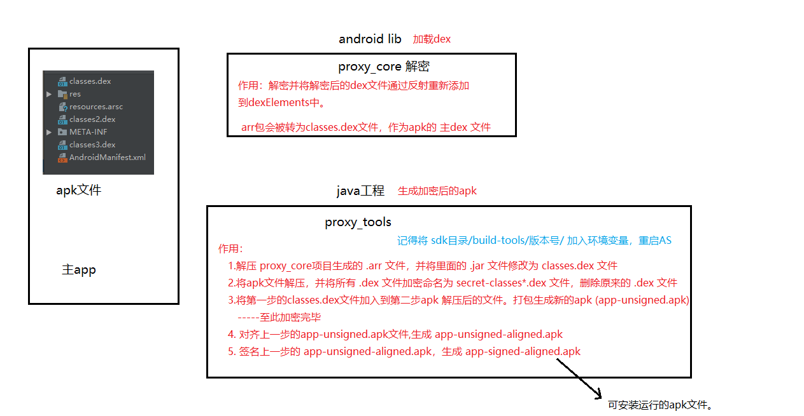
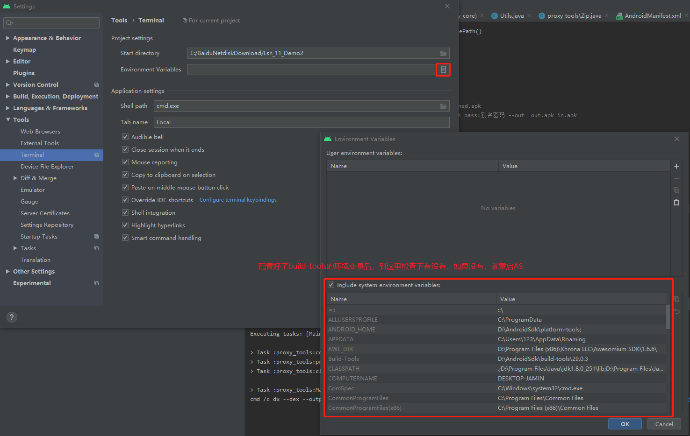
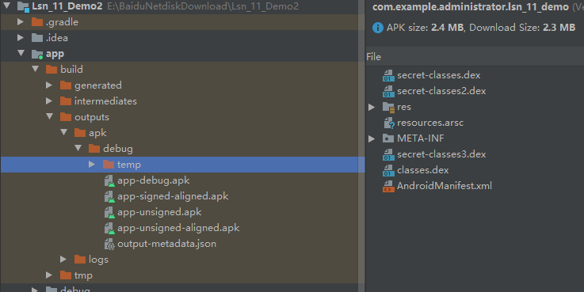

linux 和 windows 代码中执行cmd命令的区别

1. windows 需要加 `cmd /c`
2. linux 需要加 `/bin/sh -c`

```
//        //dx --dex --output out.dex in.jar
        Process process=Runtime.getRuntime().exec("cmd /c dx --dex --output "+classesDex.getAbsolutePath()
                                    +" "+classesJar.getAbsolutePath());
        // linux 或 mac下
//        Process process=Runtime.getRuntime().exec("/bin/sh -c dx --dex --output "+classesDex.getAbsolutePath()
//                +" "+classesJar.getAbsolutePath());
```

# 1.流程思想：



# 2.遇到的问题

build-tools的环境变量问题



# 3.知识剖析：

[源码查看URL](http://androidxref.com/)

## 3.1. 64K问题

[64K问题官网链接](https://developer.android.google.cn/studio/build/multidex.html#keep)

## 3.2. Dex文件加载过程

```
PathClassLoader
--> BaseDexClassLoader.findClass()方法  --->pathList.findClass()
--> DexPathList.findClass()方法  通过遍历dexElements去加载  dex.loadClassBinaryName(）

dexElements的初始化
---> this.dexElements = makePathElements(splitDexPath(dexPath), optimizedDirectory,
                                            suppressedExceptions);

所以我们只要找到dexElements初始化过程并反射，就能加载自已的dex文件了
```

# 4.步骤：

## 4.1.新建 android library 名称为：proxy_core

作用：`解密`

Androidmanifest:
```
        <!--真实的Application的全名-->
        <meta-data android:name="app_name" android:value="com.example.administrator.lsn_11_demo.MyApplication"/>
        <!--用于dex后的目录名_版本号-->
        <meta-data android:name="app_version" android:value="\dexDir_1.0"/>
```

ProxyApplication 重写 `attachBaseContext(Context base)`方法

```
    /**
     * ActivityThread创建Application之后调用的第一个方法
     * 可以在这个方法中进行解密，同时把dex交给android去加载
     */
    @Override
    protected void attachBaseContext(Context base) {
        super.attachBaseContext(base);
        //获取用户填入的metadata
        getMetaData();

        //得到当前加密了的APK文件
        File apkFile=new File(getApplicationInfo().sourceDir);  // /data/app/com.example.administrator.lsn_11_demo-iBRiZeJ3ObfOuiHWn3cfGQ==/base.apk

        //把apk解压   app_name+"_"+app_version目录中的内容需要boot权限才能用
        File versionDir = getDir(app_name+"_"+app_version,MODE_PRIVATE);
        File appDir=new File(versionDir,"app");
        File dexDir=new File(appDir,"dexDir");


        //得到我们需要加载的Dex文件
        List<File> dexFiles=new ArrayList<>();
        //进行解密（最好做MD5文件校验）
        if(!dexDir.exists() || dexDir.list().length==0){
            //把apk解压到appDir
            Zip.unZip(apkFile,appDir);
            //获取目录下所有的文件
            File[] files=appDir.listFiles();
            for (File file : files) {
                String name=file.getName();
                if(name.endsWith(".dex") && !TextUtils.equals(name,"classes.dex")){
                    try{
                        AES.init(AES.DEFAULT_PWD);
                        //读取文件内容
                        byte[] bytes=Utils.getBytes(file);
                        //解密
                        byte[] decrypt=AES.decrypt(bytes);
                        //写到指定的目录
                        FileOutputStream fos=new FileOutputStream(file);
                        fos.write(decrypt);
                        fos.flush();
                        fos.close();
                        dexFiles.add(file);

                        // 将解密后的文件拷贝到dexDir中
                        File destFile = new File(dexDir,name);
                        Utils.copyFileUsingFileChannels(file,destFile);

                    }catch (Exception e){
                        e.printStackTrace();
                    }
                }
            }
        }else{
            for (File file : dexDir.listFiles()) {
                dexFiles.add(file);
            }
        }

        try{
            //2.把解密后的文件加载到系统
            loadDex(dexFiles,versionDir);
        }catch (Exception e){
            e.printStackTrace();
        }


    }

    private void loadDex(List<File> dexFiles, File versionDir) throws Exception{
        //1.获取pathlist
        Field pathListField = Utils.findField(getClassLoader(), "pathList");
        Object pathList = pathListField.get(getClassLoader());
        //2.获取数组dexElements
        Field dexElementsField=Utils.findField(pathList,"dexElements");
        Object[] dexElements=(Object[])dexElementsField.get(pathList);
        //3.反射到初始化dexElements的方法
        Method makeDexElements=Utils.findMethod(pathList,"makePathElements",List.class,File.class,List.class);

        ArrayList<IOException> suppressedExceptions = new ArrayList<IOException>();
        Object[] addElements=(Object[])makeDexElements.invoke(pathList,dexFiles,versionDir,suppressedExceptions);

        //合并数组
        Object[] newElements= (Object[])Array.newInstance(dexElements.getClass().getComponentType(),dexElements.length+addElements.length);
        System.arraycopy(dexElements,0,newElements,0,dexElements.length);
        System.arraycopy(addElements,0,newElements,dexElements.length,addElements.length);

        //替换classloader中的element数组
        dexElementsField.set(pathList,newElements);
    }

    private void getMetaData() {
        try{
            ApplicationInfo applicationInfo = getPackageManager().getApplicationInfo(
                    getPackageName(), PackageManager.GET_META_DATA);
            Bundle metaData=applicationInfo.metaData;
            if(null!=metaData){
                if(metaData.containsKey("app_name")){
                    app_name=metaData.getString("app_name");
                }
                if(metaData.containsKey("app_version")){
                    app_version=metaData.getString("app_version");
                }
            }

        }catch(Exception e){
            e.printStackTrace();
        }
    }
```

## 4.2.新建 java-library 名称为：proxy_tools



作用：`加密`

1. 制作只包含解密代码的dex文件
   ```
        // 将4.1. 解密工程生成的 .arr 文件解压缩，并将里面的 .jar 文件生成 .dex 文件
         File aarFile=new File("proxy_core/build/outputs/aar/proxy_core-debug.aar");
        File aarTemp=new File("proxy_tools/temp");
        Zip.unZip(aarFile,aarTemp);
        File classesJar=new File(aarTemp,"classes.jar");
        File classesDex=new File(aarTemp,"classes.dex");

      //dx --dex --output out.dex in.jar
        Process process=Runtime.getRuntime().exec("cmd /c dx --dex --output "+classesDex.getAbsolutePath()
                                    +" "+classesJar.getAbsolutePath());
        // linux 或 mac下
        // Process process=Runtime.getRuntime().exec("/bin/sh -c dx --dex --output "+classesDex.getAbsolutePath()
        //        +" "+classesJar.getAbsolutePath());

        process.waitFor();
        if(process.exitValue()!=0){
            throw new RuntimeException("dex error");
        }
   ```
2. 加密APK中所有的dex文件
    ```
     File apkFile=new File("app/build/outputs/apk/debug/app-debug.apk");
        File apkTemp=new File("app/build/outputs/apk/debug/temp");
        Zip.unZip(apkFile,apkTemp);
        //只要dex文件拿出来加密
        File[] dexFiles=apkTemp.listFiles(new FilenameFilter() {
            @Override
            public boolean accept(File file, String s) {
                return s.endsWith(".dex");
            }
        });
        //AES加密了
        AES.init(AES.DEFAULT_PWD);
        for (File dexFile : dexFiles) {
            byte[] bytes = Utils.getBytes(dexFile);
            byte[] encrypt = AES.encrypt(bytes);
            FileOutputStream fos=new FileOutputStream(new File(apkTemp,
                    "secret-"+dexFile.getName()));
            fos.write(encrypt);
            fos.flush();
            fos.close();
            dexFile.delete();
        }

    ```
3.  把dex放入apk解压目录，重新压成apk文件
    ```
     classesDex.renameTo(new File(apkTemp,"classes.dex"));
        File unSignedApk=new File("app/build/outputs/apk/debug/app-unsigned.apk");
        Zip.zip(apkTemp,unSignedApk);
    ```
4. 对齐和签名
    ```
   //        zipalign -v -p 4 my-app-unsigned.apk my-app-unsigned-aligned.apk
        File alignedApk=new File("app/build/outputs/apk/debug/app-unsigned-aligned.apk");
        process=Runtime.getRuntime().exec("cmd /c zipalign -v -p 4 "+unSignedApk.getAbsolutePath()
                        +" "+alignedApk.getAbsolutePath());
        process.waitFor();
        if(process.exitValue()!=0){
            throw new RuntimeException("dex error");
        }


        // apksigner sign --ks my-release-key.jks --out my-app-release.apk my-app-unsigned-aligned.apk
        //apksigner sign  --ks jks文件地址 --ks-key-alias 别名 --ks-pass pass:jsk密码 --key-pass pass:别名密码 --out  out.apk in.apk
        File signedApk=new File("app/build/outputs/apk/debug/app-signed-aligned.apk");
        File jks=new File("proxy_tools/proxy2.jks");
        process=Runtime.getRuntime().exec("cmd /c apksigner sign --ks "+jks.getAbsolutePath()
                            +" --ks-key-alias jett --ks-pass pass:123456 --key-pass pass:123456 --out "
                                +signedApk.getAbsolutePath()+" "+alignedApk.getAbsolutePath());
        process.waitFor();
        if(process.exitValue()!=0){
            throw new RuntimeException("dex error");
        }
        System.out.println("执行成功");

    ```
# 5. 工具

[签名](https://developer.android.google.cn/studio/publish/app-signing.html#signing-manually)

1. dx：sdk\build-tools，class.jar生成dex文件
   -  `dx --dex --output out.dex in.jar`
2. [zipalign：](https://developer.android.google.cn/studio/command-line/zipalign.html) ，sdk\build-tools，apk整理对齐工具。未压缩的数据开头均相对于文件开头部分执行特定的字节对齐，减少应用运行内存。
   - `zipalign [-v] [-f]  4 in.apk out.apk`
3. [apksigner](https://developer.android.google.cn/studio/command-line/apksigner.html#options-sign-general)，sdk\build-tools\24.0.3 以上，apk签名工具
   - `apksigner sign  --ks jks文件地址 --ks-key-alias 别名 --ks-pass pass:jsk密码 --key-pass pass:别名密码 --out  out.apk in.apk`
4. 
