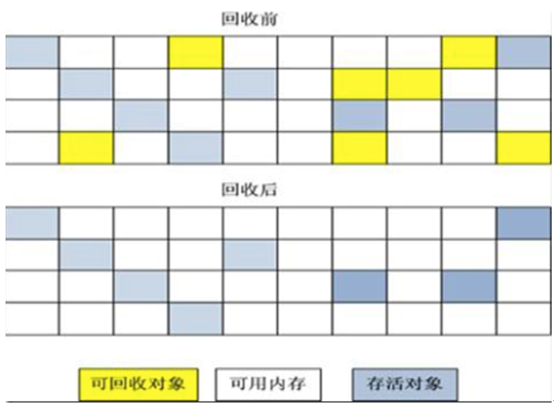
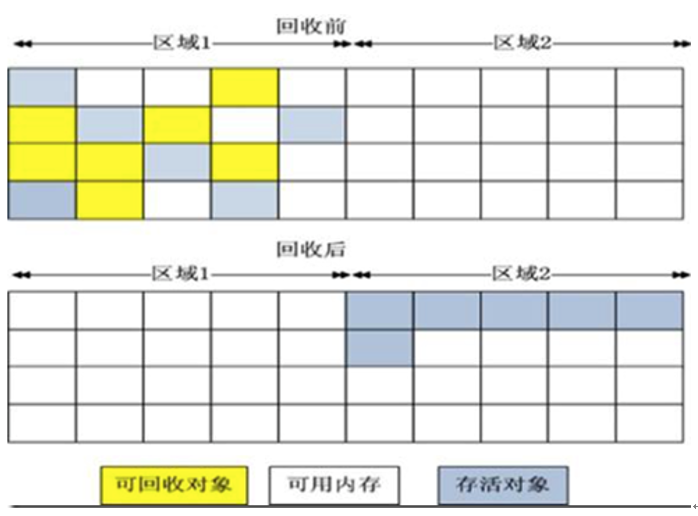
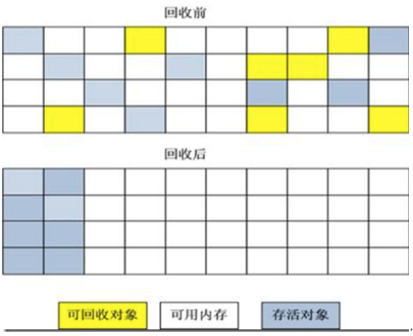
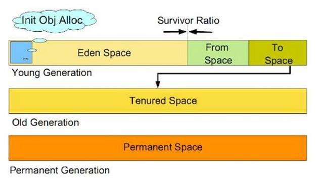
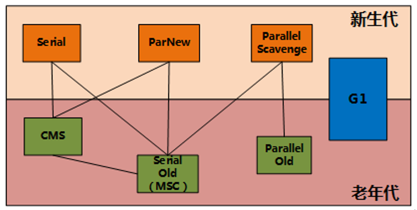
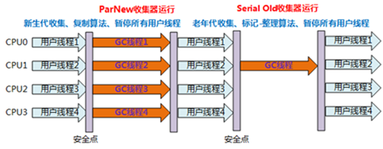
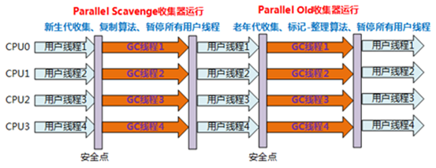
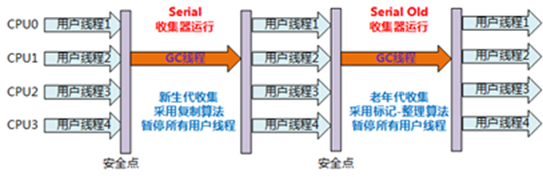
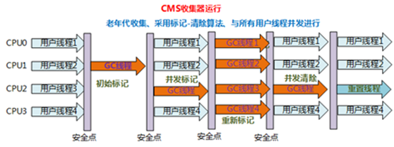

# 1.内存抖动

定义：`内存频繁的分配与回收，（分配速度大于回收速度时最终会产生OOM）`

我们知道，String是通过数组实现的，无法扩容，也就是说每次循环都会创建出一个新的String对象，当stringList的size比较大的时候，  
String对象就会频繁的创建和回收就会造成内存抖动。如以下代码

```
private String listToString(List<String> stringList) {
    //先取第一个
    String result = stringList.get(0);
    for (int i = 1; i < stringList.size(); i++) {
        //然后通过字符串累加的方式拼接字符串
        result = result + "," + stringList.get(i);

    }
    return result;
}
```

# 2.内存回收算法

## 2.1.标记清除算法(高效)

清除后，内存不连续



## 2.2.复制算法Copying

将可用内存 , 分为两个想等于内存区域块 , 区域 1  和 区域 2  , 使用时只使用其中的一个区域 ;

- 垃圾回收前 , 只使用区域 1  的内存
- 垃圾回收后 , 将区域 1  的内存中可用对象复制到区域 2
- 复制时的可用对象在区域 2  紧密排列 , 不留空隙
- 这样区域 2 中可用内存区域是大块完整的内存 , 不会产生内存碎片


该垃圾回收算法缺陷也很明显 , 就是会浪费一半内存空间 ;

有些对象的声明周期等同于应用声明周期 , 如 Android 中的 Application 等 , 该内存对象根本不释放 , 持续往返复制这类长生存期的对象 , 会极大降低效率 ;



## 2.3.标记压缩算法Mark-Compact

- 首先标记可回收对象
- 然后回收这些对象
- 最后整理存活对象 , 将其拷贝到一块连续内存中

该方法没有复制算法浪费一半内存的问题 ;

该方法因为多了一个压缩过程 , 因此有额外的开销 ;



## 2.4.分代收集算法（最常用）

Java 虚拟机的堆内存分区 :

- 年轻代 ( Yong Generation )
- 老年代 ( Old Generation )
- 持久代 ( Permanent Generation )

1. 年轻代内存分为三块 :`Eden 区域`、`From 区域`、`To 区域`  
   内存运行机制 : 新创建的对象 , 放在年轻代内存块中 , 开始时放在 Eden 区域 , 当 Eden 区域存满后 , 会将存活的对象转移到 From 区域 和 To 区域 ;
2. 老年代内存区域 :
   - 对象晋升 : 对象每经过一次 GC 垃圾回收 , 其年龄就会加 1 11 ; 当年龄到达虚拟机设置的阈值之后 , 就会被放入老年代内存块中 ;
   - 存放对象 : 老年代存放由年轻代晋升上来的对象 , 这是活得时间比较长的对象 ;
3. 注意：Permanent（持久代）和垃圾回收没什么关系，主要用来存放类，方法信息，也能作为常量沲使用，不同VM不同实现，有些没这个区






### 2.4.1.Serial串行收集器

年轻代 , 复制算法 , 单线程 GC , 暂停用户线程


### 2.4.2.ParNew 收集器

年轻代 , 复制算法 , 多线程 GC , 暂停用户线程



### 2.4.3.Parallel Scavenge收集器

吞吐量=运行用户代码时间/(运行用户代码时间+垃圾收集时间)。

年轻代 , 复制算法 , 多线程 GC , 暂停用户线程 ( 关注吞吐量 )



### 2.4.4.Serial Old收集器



### 2.4.5.Parallel Old收集器


### `2.4.6.CMS 收集器（Android中最常用）`

全称 Concurrent Mark Sweep , 并发标记清除收集器

`Android 中内存抖动产生 OOM , 就是因为使用的是 CMS 垃圾回收器 ( 收集器 )`

缺点 :
- CPU 性能消耗 : 多开线程 , 意味着 CPU 性能消耗多 ;
- 内存碎片 : 使用 标记-清除算法 , 会造成很多内存碎片 , 严重的话导致 OOM ;
- 浮动垃圾 : 由于 GC 线程 与用户线程并发 造成的 , 在 GC 运行过程中产生的用户线程垃圾 , 需要等待下一次 GC 清理 , 这些垃圾就是浮动垃圾 ;



<font color = red>CMS采用"标记-清理"算法实现以获取最短回收停顿时间为目标的收集器</font>

- 初始标记：标记一下GC Roots能直接关联到的对象
- 并发标记：进行GC Roots Tracing 的过程
- 重新标记：是为了修正并发标记期间因用户程序继续运行而导致标记产品变动的那一部分对象的标记记录
- 并发清除：清除不能到达GC Roots的对象　
- 重置线程：更新之前使用过的数据

# 3.优化内存的良好编码习惯

1. 数据类型
   - 不要使用比需求更占空间的基本数据类型
2. 循环尽量用foreach,少用iterator,自动装箱尽量少用
3. 数据结构与算法的解度处理
   - 数组，链表，栈，树，图。。。。。。
   - 数据量`千级以内可以使用Sparse数组(key为整数)，ArrayMap（key为对象)`,性能不如HashMap但节约内存
4. 枚举  
   缺点：
   - 每一个枚举值都是一个单例对象,在使用它时会增加额外的内存消耗,所以枚举相比与 Integer 和 String 会占用更多的内存
   - 较多的使用 Enum 会增加 DEX 文件的大小,会造成运行时更多的IO开销,使我们的应用需要更多的空间
   - 特别是分dex多的大型APP，枚举的初始化很容易导致ANR  
   改进：
   ```
   public class SHAPE {
            public static final int RECTANGLE=0;
            public static final int TRIANGLE=1;
            public static final int SQUARE=2;
            public static final int CIRCLE=3;
        
            // flag为true 代表可以RECTANGLE|TRIANGLE 这么写
            @IntDef(flag=true,value={RECTANGLE,TRIANGLE,SQUARE,CIRCLE})
            @Target({ElementType.PARAMETER,ElementType.METHOD,ElementType.FIELD})
            @Retention(RetentionPolicy.SOURCE)
            public @interface Model{
        
            }
        
            private @Model int value=RECTANGLE;
            public void setShape(@Model int value){
                this.value=value;
            }
            @Model
            public int getShape(){
                return this.value;
            }
        }
   ```
5. static、staticfinal的问题
   - static会由编译器调用clinit方法进行初始化
   - static final不需要进行初始化工作，打包在dex文件中可以直接调用，并不会在类初始化申请内存
   所以基本数据类型的成员，可以全写成static final
6. 字符串的连接尽量少用加号(+)，尽量使用StringBuilder或StringBuffer
7. 重复申请内存的问题
   - 同一个方法多次调用，如递归函数 ，回调函数中new对象,读流直接在循环中new对象等
   - 不要在onMeause()  onLayout() onDraw()  中去刷新UI(requestLayout、invalidate)
8. 避免GC回收将来要重用的对象
   - 内存设计模式对象沲+LRU算法
   ```
    public abstract class ObjectPool<T> {
        //空闲沲，用户从这个里面拿对象
        private SparseArray<T> freePool;
        //正在使用沲，用户正在使用的对象放在这个沲记录
        private SparseArray<T> lentPool;
    
        //沲的最大值
        private int maxCapacity;
    
        public ObjectPool(int initialCapacity, int maxCapacity) {
            //初始化对象沲
            initalize(initialCapacity);
            this.maxCapacity=maxCapacity;
        }
    
        private void initalize(int initialCapacity) {
            lentPool=new SparseArray<>();
            freePool=new SparseArray<>();
            for(int i=0;i<initialCapacity;i++){
                freePool.put(i,create());
            }
        }
    
        /**
         * 申请对象
         * @return
         */
        public T acquire(){
    
            T t=null;
            synchronized (freePool){
                int freeSize=freePool.size();
                for(int i=0;i<freeSize;i++){
                    int key=freePool.keyAt(i);
                    t=freePool.get(key);
                    if(t!=null){
                        this.lentPool.put(key,t);
                        this.freePool.remove(key);
                        return t;
                    }
                }
                //如果没对象可取了
                if(t==null && lentPool.size()+freeSize<maxCapacity){
                    //这里可以自己处理,超过大小
                    if(lentPool.size()+freeSize==maxCapacity){
                        return null;
                    }
                    t=create();
                    lentPool.put(lentPool.size()+freeSize,t);    
                }
            }
            return t;
        }
    
        /**
         * 回收对象
         * @return
         */
        public void release(T t){
            if(t==null){
                return;
            }
            int key=lentPool.indexOfValue(t);
            //释放前可以把这个对象交给用户处理
            restore(t);
    
            this.freePool.put(key,t);
            this.lentPool.remove(key);
    
        }
    
        protected  void restore(T t){
        };
      
        protected abstract T create();
    
        public ObjectPool(int maxCapacity) {
            this(maxCapacity/2,maxCapacity);
        }

    }
   ```
9. Activity组件泄漏
   - 非业务需要不要把activity的上下文做参数传递，可以传递application的上下文
   - 和Activity有关联的对象写成static   如private static Button btn;   private static Drawable drawable;
   - 非静态内部类和匿名内部内会持有activity引用
   - 单例模式持有activity引用
   - handler.postDelayed()问题
     - 如果开启的线程需要传入参数，`用弱引接收可解决问题`
     - handler记得清除removeCallbacksAndMessages(null)
10. 尽量使用IntentService,而不是Service
11. webView造成的内存抖动
     - 只能通过当开进程去解决（在Manifest中对Activity添加process）

