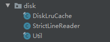

# 1.bitmap复用
先介绍下Bitmap在不同版本下内存存储的位置：
- `3.0以下`　Bitmap　　`native`
- `3.0以后---8.0之前`　`java堆`
- `8.0开始`　　　　　又是`native`

## 1.1.不同版本下Bitmap复用条件

- `Android　KITKAT-4.4(api19)之前`,要求：新的Bitmap需要和复用的`Bitmap宽、高必须一样、inSampleSize=1`
- `Android　KITKAT-4.4(api19)以后`，只需要满足Bitmap的字节数，小于复用的字节数就行

```
    // 是否可以复用之前的内存
    private boolean checkInBitmap(Bitmap bitmap, int w, int h, int inSampleSize) {
        if(Build.VERSION.SDK_INT < Build.VERSION_CODES.KITKAT){  // 19以前
            return bitmap.getWidth()==w && bitmap.getHeight()==h && inSampleSize==1;
        }
        if(inSampleSize>=1){
            w/=inSampleSize;
            h/=inSampleSize;
        }
        int byteCount=w*h*getPixelsCount(bitmap.getConfig());
        return byteCount<=bitmap.getAllocationByteCount();
    }
```

## 1.2.复用

关键在：BitmapFactory.Options的`inMutable`、和`inBitmap`

# 2.LruCache简介（内存缓存）
这是Android SDK中自带的缓存工具，原理是`带排序功能的LinkedHashMap（双向链表）`。

淘汰采用的是`最近最少使用算法`：如果使用频繁的对象就会被放到链表的头部进行重排序。不频繁的放在链表的尾部。

# 3.DiskLruCache简介（磁盘缓存）

采用的还是LinkedHashMap（双向链表）实现缓存算法的

[Release版本下载](https://github.com/JakeWharton/DiskLruCache/releases),复制源码内容到项目中



## 3.1打开缓存
```
// open()方法接收四个参数，
// 第一个参数指定的是数据的缓存地址
// 第二个参数指定当前应用程序的版本号
// 第三个参数指定同一个key可以对应多少个缓存文件，基本都是传1
// 第四个参数指定最多可以缓存多少字节的数据。一般10*1024*1024就够了
public static DiskLruCache open(File directory, int appVersion, int valueCount, long maxSize)

// 缓存地址通常都会存放在 /sdcard/Android/data/<application package>/cache 这个路径下面，
// 但同时我们又需要考虑如果这个手机没有SD卡，或者SD正好被移除了的情况，因此比较优秀的程序都会专门写一个方法来获取缓存地址，如下所示：
public File getDiskCacheDir(Context context, String uniqueName) {
	String cachePath;
	if (Environment.MEDIA_MOUNTED.equals(Environment.getExternalStorageState())
			|| !Environment.isExternalStorageRemovable()) {
		cachePath = context.getExternalCacheDir().getPath();
	} else {
		cachePath = context.getCacheDir().getPath();
	}
	return new File(cachePath + File.separator + uniqueName);
}
```

## 3.2.写入缓存

```

String imageUrl = "https://img-my.csdn.net/uploads/201309/01/1378037235_7476.jpg";
String key = hashKeyForDisk(imageUrl);
DiskLruCache.Editor editor = mDiskLruCache.edit(key);
OutputStream outputStream = editor.newOutputStream(0);//通过这个outputStream写入缓存。

// 怎样才能让key和图片的URL能够一一对应.其实最简单的做法就是将图片的URL进行MD5编码，编码后的字符串肯定是唯一的，
// 并且只会包含0-F这样的字符，完全符合文件的命名规则。
public String hashKeyForDisk(String key) {
	String cacheKey;
	try {
		final MessageDigest mDigest = MessageDigest.getInstance("MD5");
		mDigest.update(key.getBytes());
		cacheKey = bytesToHexString(mDigest.digest());
	} catch (NoSuchAlgorithmException e) {
		cacheKey = String.valueOf(key.hashCode());
	}
	return cacheKey;
}
 
private String bytesToHexString(byte[] bytes) {
	StringBuilder sb = new StringBuilder();
	for (int i = 0; i < bytes.length; i++) {
		String hex = Integer.toHexString(0xFF & bytes[i]);
		if (hex.length() == 1) {
			sb.append('0');
		}
		sb.append(hex);
	}
	return sb.toString();
}
```

## 3.3.读取缓存

```
try {
	String imageUrl = "https://img-my.csdn.net/uploads/201309/01/1378037235_7476.jpg";
	String key = hashKeyForDisk(imageUrl);
	DiskLruCache.Snapshot snapShot = mDiskLruCache.get(key);
	if (snapShot != null) {
		InputStream is = snapShot.getInputStream(0);
		Bitmap bitmap = BitmapFactory.decodeStream(is);
		mImage.setImageBitmap(bitmap);
	}
} catch (IOException e) {
	e.printStackTrace();
}
```

## 3.4.移除缓存

这个方法我们并不应该经常去调用它。因为你完全不需要担心缓存的数据过多从而占用SD卡太多空间的问题，DiskLruCache会根据我们在调用open()
方法时设定的缓存最大值来自动删除多余的缓存。只有你确定某个key对应的缓存内容已经过期，需要从网络获取最新数据的时候才应该调用remove()
方法来移除缓存。

```
try {
	String imageUrl = "https://img-my.csdn.net/uploads/201309/01/1378037235_7476.jpg";  
	String key = hashKeyForDisk(imageUrl);  
	mDiskLruCache.remove(key);
} catch (IOException e) {
	e.printStackTrace();
}
```

# 4.图片缓存(重点)


具体的代码写在了[ImageCache.java](../code/lsn7Code/ImageCache.java)

下面代码展示了如何使用
```
    Bitmap bitmap=ImageCache.getInstance().getBitmapFromMemory(String.valueOf(position));
    if(null==bitmap){
        //如果内存没数据，就去复用池找
        Bitmap reuseable=ImageCache.getInstance().getReuseable(60,60,1);
        //reuseable能复用的内存
        //从磁盘找
        bitmap = ImageCache.getInstance().getBitmapFromDisk(String.valueOf(position),reuseable);
        //如果磁盘中也没缓存,就从网络下载
        if(null==bitmap){
            // 这行代码模拟网络请求
            bitmap=ImageResize.resizeBitmap(context,R.mipmap.wyz_p,80,80,false,reuseable);
            ImageCache.getInstance().putBitmapToMemeory(String.valueOf(position),bitmap);
            ImageCache.getInstance().putBitMapToDisk(String.valueOf(position),bitmap);
            Log.i("jett","从网络加载了数据");
        }else{
            Log.i("jett","从磁盘中加载了数据");
        }

    }else{
        Log.i("jett","从内存中加载了数据");
    }
```


