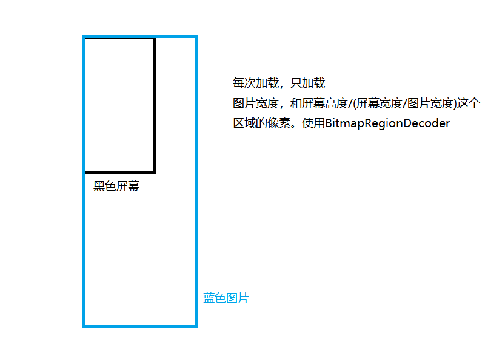

# 1.长图优化



滑动使用了：GetureDetector 和 Scroller。具体代码查看[BigView.java](../code/lsn8Code/BigView.java)

# 2.电量优化一

## 2.1.电量测试
测试移动设备电量消耗快慢的一种测试方法。一般用平均电流来衡量电量消耗速度。平均电流越小，说明设备使用时间越长。但是平均电流多大才说明不耗电却没有一个统一标准。

- 硬件测试：利用硬件设备测试被测设备的电流，统计一段时间内(使用某个功能模块)的平均电流值。
- 软件测试：利用系统工具导出分析报告

## 2.2.Android电量测试工具`Battery Historian`

### 2.2.1.安装

Battery Historian是google开源的电池历史数据分析工具。[具体安装](https://github.com/google/battery-historian)

[Docker下载](https://docs.docker.com/engine/install/)

windows下docker报错的解决方法：This error may also indicate that the docker daemon is not running....

```
cd "C:\Program Files\Docker\Docker"
./DockerCli.exe -SwitchDaemon
```

安装好Docker之后，github上让我们运行

`docker -- run -p <port>:9999 gcr.io/android-battery-historian/stable:3.0 --port 9999`

选择一个端口号，然后在命令中用该端口号替换<port>,但是这个地址貌似需要翻墙。我们可以使用镜像

`docker run -p 9999:9999 blystad/battery-historian`

一段漫长的等待……  
然后出现`Listening on port：9999`表示安装成功，进入`localhost:9999`

如果很慢接着安装[cdn](https://github.com/justjavac/ReplaceGoogleCDN/)

其实就是一种高防免备案的方式


还有源码编译安装，可以自己去[具体安装](https://github.com/google/battery-historian)里面去看

### 2.2.2.使用

1. 重置：`adb shell dumpsys batterystats --reset`
2. 获取完整的wakelock信息:`adb shell dumpsys batterystats --enable full-wake-history `
3. 拔掉USB（让设备不处于充电状态），等待一段时间获得报告:
4. 获取报告：
   - &gt;=7.0，`adb bugreport bugreport.zip`
   - &lt;7.0，`adb bugreport > bugreport.txt`

最后将获取出来的报告，上传到Battery Historian中进行分析`localhost:9999`。

分析图表解析，分析参数说明：
1. `WakeLock级别`
   - `PARTIAL_WAKE_LOCK`：保证CPU保持高性能运行，而屏幕和键盘背光（也可能是触摸按键的背光）关闭。`一般情况下都会使用这个WakeLock。`
   - ACQUIRE_CAUSES_WAKEUP：这个WakeLock除了会使CPU高性能运行外还会导致屏幕亮起，即使屏幕原先处于关闭的状态下。
   - ON_AFTER_RELEASE：如果释放WakeLock的时候屏幕处于亮着的状态，则在释放WakeLock之后让屏幕再保持亮一小会。如果释放WakeLock的时候屏幕本身就没亮，则不会有动作。
   - API17被弃用的WakeLock：保持屏幕长亮
     - SCREEN_DIM_WAKE_LOCK：保证屏幕亮起，但是亮度可能比较低。同时键盘背光也可以不亮。
     - SCREEN_BRIGHT_WAKE_LOCK ：保证屏幕全亮，同时键盘背光也亮。
     - FULL_WAKE_LOCK：表现和SCREEN_BRIGHT_WAKE_LOCK 类似，但是区别在于这个等级的WakeLock使用的是最高亮度
       - 推荐是用WindowFlagWindowManager.LayoutParams.FLAG_KEEP_SCREEN_ON。使用方法是：
         在Activity中： getWindow().addFlags(WindowManager.LayoutParams.FLAG_KEEP_SCREEN_ON);
         在布局中添加这个属性：android:keepScreenOn="true"
2. CPU runing：cpu运行的状态，是否被唤醒
3. Kernel only uptime：只有内核运行时间
4. Activity Manager Proc：活跃的用户进程
   5. Mobile network type：网络类型
5. Mobile radio active：移动蜂窝信号 BP侧耗电
6. Crashes(logcat)：某个时间点出现crash的应用
7. Doze：是否进入doze模式
8. Device active：和Doze相反
9. JobScheduler：异步作业调度
10. SyncManager：同步操作
11. Temp White List：电量优化白名单
12. Phone call：是否打电话
13. `GPS`：是否使用GPS
14. `Network connectivity`：网络连接状态（wifi、mobile是否连接）
15. Mobile signal strength：移动信号强度（great\good\moderate\poor）
16. `Wifi scan`：是否在扫描wifi信号
17. Wifi supplicant：是否有wifi请求
18. Wifi radio：是否正在通过wifi传输数据
19. Wifi signal strength：wifi信号强度（great\good\moderate\poor）
20. Wifi running：wifi组件是否在工作(未传输数据)
21. Wifi on：同上
22. `Audio`：音频是否开启
23. `Camera`：相机是否在工作
24. `Video`：是否在播放视频
25. Foreground process：前台进程
26. Package install：是否在进行包安装
27. Package active：包管理在工作
28. Battery level：电池当前电量
29. Temperature：电池温度
30. Logcat misc：是否在导出日志
31. Plugged：充电


