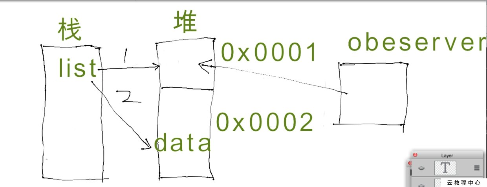

@[TOC](RecycleView问题)

## 1.为什么调用notifyDataSetChanged()无效

        下面是失效的源代码：

``` 
    private SortedList<File> fileList; //一开始为null;
    public void setFileList(SortedList<File> fileList){
        this.fileList = fileList;
        notifyDataSetChanged();
    }
```

        其实就是这里出现了问题。刚开始list是个空的对象,然后把空的集合数据塞给了adapter,于是有了他的一个观察者RecyclerViewDataObserver,他观察的是这个list对象所指的地址上的堆内存里的数据。但是现在通过网络访问拿到数据以后,直接用list指向了data,现在list指向的地址变了,数据也有了。但是RecyclerViewDataObserver观察的永远是list刚开始所指的那个地址。所以不会起作用。为了好理解,画个图:



         <font color=red>解决：一定要保证数据为同个对象（hashCode要一致）</font>

```
    public void setFileList(SortedList<File> fileList) {
        /*如果不这么做的话，RecyclerViewDataObserver观察的永远是之前fileList的堆内存里的数据，
          即使重新 this.fileList = fileList; 附了值但是 RecyclerViewDataObserve还是指向最开始堆内存中的数据*/
        if(this.fileList == null)
            this.fileList = fileList;
        else{
            this.fileList.clear();
            for(int i=0; i< fileList.size() ; i++)
                this.fileList.add(fileList.get(i));
        }
        notifyDataSetChanged();
    }
```


