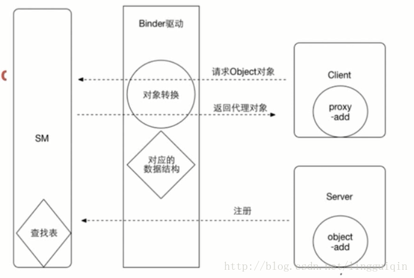
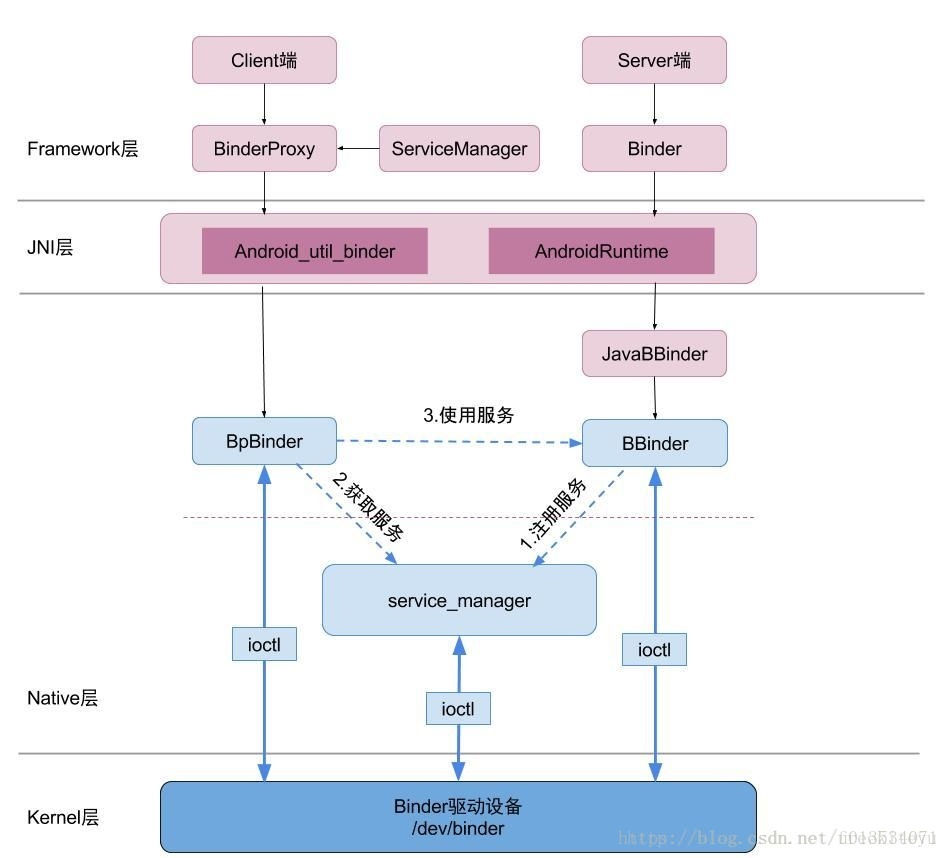
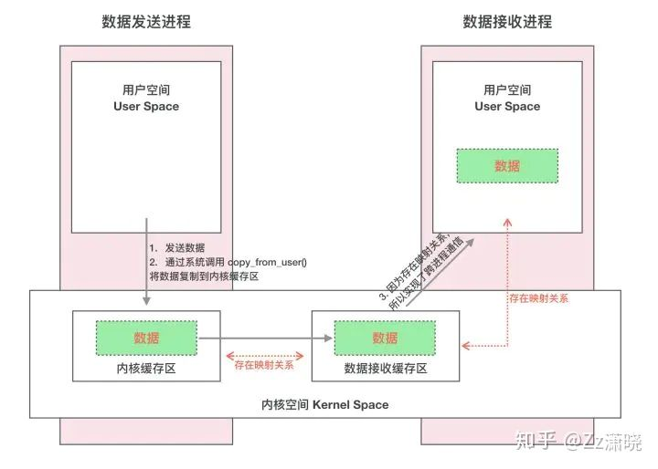
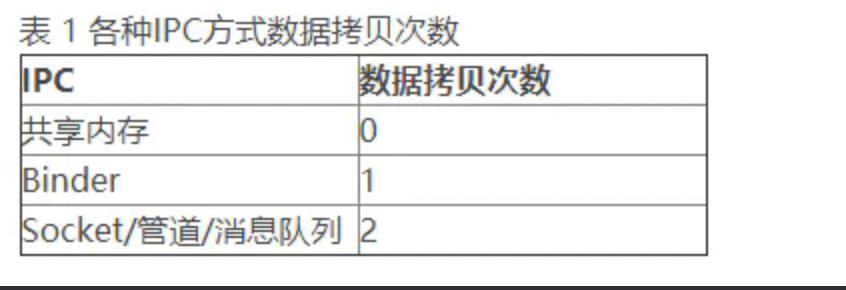

@[TOC](IPC-Binder的原理和源码阅读)

## Binder通信原理:

1. 注册建立ServiceManager表。
2. Service1、Service2通过Binder驱动申请注册到ServiceManager中。
3. Client需要与Service2进行通信,跨进程无法直接通信，需要先通过ServiceManger中查询到Service2。借助Binder驱动返回一个Service2的代理对象。  
Client直接跟Service2代理对象进行操作，通过Binder驱动映射操作Service2真实对象，从而完成通信。





## 为什么使用Binder通信

### 1.性能方面

跨进程通讯中，只有socket支持Client-Server的通信方式，但是socket作为一款通用接口，其传输效率低，开销大，主要用在跨网络的进程间通信和本机上进程间的低速通信。消息队列和管道采用存储-转发方式，即数据先从发送方缓存区拷贝到内核开辟的缓存区中，然后再从内核缓存区拷贝到接收方缓存区，至少有两次拷贝过程。共享内存虽然无需拷贝，但控制复杂，难以使用。





## 2.安全性能方面

首先传统IPC的接收方无法获得对方进程可靠的UID和PID（用户ID进程ID），从而无法鉴别对方身份。Android为每个安装好的应用程序分配了自己的UID，故进程的UID是鉴别进程身份的重要标志。使用传统IPC只能由用户在数据包里填入UID和PID，但这样不可靠，容易被恶意程序利用。可靠的身份标记只有由IPC机制本身在内核中添加。其次传统IPC访问接入点是开放的，无法建立私有通道。比如命名管道的名称，systemV的键值，socket的ip地址或文件名都是开放的，只要知道这些接入点的程序都可以和对端建立连接，不管怎样都无法阻止恶意程序通过猜测接收方地址获得连接。

基于以上原因，Android需要建立一套新的IPC机制来满足系统对通信方式，传输性能和安全性的要求，这就是Binder。

Binder基于Client-Server通信模式，传输过程只需一次拷贝，为发送发添加UID/PID身份，既支持实名Binder也支持匿名Binder，安全性高。


## AIDL的源码:

```
public interface MessageAIDL extends android.os.IInterface
{
  /** Default implementation for MessageAIDL. */
  public static class Default implements com.east.connotationjokes.MessageAIDL
  {
    @Override public java.lang.String getUserName() throws android.os.RemoteException
    {
      return null;
    }
    @Override public java.lang.String getPwd() throws android.os.RemoteException
    {
      return null;
    }
    @Override
    public android.os.IBinder asBinder() {
      return null;
    }
  }
  /** Local-side IPC implementation stub class. */
  public static abstract class Stub extends android.os.Binder implements com.east.connotationjokes.MessageAIDL
  {
    private static final java.lang.String DESCRIPTOR = "com.east.connotationjokes.MessageAIDL";
    /** Construct the stub at attach it to the interface. */
    public Stub()
    {  //在Binder中通过DESCRIPTOR这个类似于key的东西去注册
      this.attachInterface(this, DESCRIPTOR);
    }
    /**
     * Cast an IBinder object into an com.east.connotationjokes.MessageAIDL interface,
     * generating a proxy if needed.
     */
    public static com.east.connotationjokes.MessageAIDL asInterface(android.os.IBinder obj)
    {
      if ((obj==null)) {
        return null;
      }
      android.os.IInterface iin = obj.queryLocalInterface(DESCRIPTOR);
      if (((iin!=null)&&(iin instanceof com.east.connotationjokes.MessageAIDL))) {
        return ((com.east.connotationjokes.MessageAIDL)iin);
      }
      //返回一个代理对象,客户端通过这个代理对象去调用方法
      return new com.east.connotationjokes.MessageAIDL.Stub.Proxy(obj);
    }
    @Override public android.os.IBinder asBinder()
    {
      return this;
    }
    @Override public boolean onTransact(int code, android.os.Parcel data, android.os.Parcel reply, int flags) throws android.os.RemoteException
    {
      java.lang.String descriptor = DESCRIPTOR;
      switch (code)
      {
        case INTERFACE_TRANSACTION:
        {
          reply.writeString(descriptor);
          return true;
        }
        case TRANSACTION_getUserName:
        {
          data.enforceInterface(descriptor);
          java.lang.String _result = this.getUserName();
          reply.writeNoException();
          reply.writeString(_result);
          return true;
        }
        case TRANSACTION_getPwd:
        {
          data.enforceInterface(descriptor);
          java.lang.String _result = this.getPwd();
          reply.writeNoException();
          reply.writeString(_result);
          return true;
        }
        default:
        {
          return super.onTransact(code, data, reply, flags);
        }
      }
    }
    private static class Proxy implements com.east.connotationjokes.MessageAIDL
    {
      private android.os.IBinder mRemote;
      Proxy(android.os.IBinder remote)
      {
        mRemote = remote;
      }
      @Override public android.os.IBinder asBinder()
      {
        return mRemote;
      }
      public java.lang.String getInterfaceDescriptor()
      {
        return DESCRIPTOR;
      }
      @Override public java.lang.String getUserName() throws android.os.RemoteException
      {
        android.os.Parcel _data = android.os.Parcel.obtain();
        android.os.Parcel _reply = android.os.Parcel.obtain();
        java.lang.String _result;
        try {
          _data.writeInterfaceToken(DESCRIPTOR);
          boolean _status = mRemote.transact(Stub.TRANSACTION_getUserName, _data, _reply, 0);
          if (!_status && getDefaultImpl() != null) {
            return getDefaultImpl().getUserName();
          }
          _reply.readException();
          _result = _reply.readString();
        }
        finally {
          _reply.recycle();
          _data.recycle();
        }
        return _result;
      }
      @Override public java.lang.String getPwd() throws android.os.RemoteException
      {
        android.os.Parcel _data = android.os.Parcel.obtain();
        android.os.Parcel _reply = android.os.Parcel.obtain();
        java.lang.String _result;
        try {
          _data.writeInterfaceToken(DESCRIPTOR);
          boolean _status = mRemote.transact(Stub.TRANSACTION_getPwd, _data, _reply, 0);
          if (!_status && getDefaultImpl() != null) {
            return getDefaultImpl().getPwd();
          }
          _reply.readException();
          _result = _reply.readString();
        }
        finally {
          _reply.recycle();
          _data.recycle();
        }
        return _result;
      }
      public static com.east.connotationjokes.MessageAIDL sDefaultImpl;
    }
    static final int TRANSACTION_getUserName = (android.os.IBinder.FIRST_CALL_TRANSACTION + 0);
    static final int TRANSACTION_getPwd = (android.os.IBinder.FIRST_CALL_TRANSACTION + 1);
    public static boolean setDefaultImpl(com.east.connotationjokes.MessageAIDL impl) {
      if (Stub.Proxy.sDefaultImpl == null && impl != null) {
        Stub.Proxy.sDefaultImpl = impl;
        return true;
      }
      return false;
    }
    public static com.east.connotationjokes.MessageAIDL getDefaultImpl() {
      return Stub.Proxy.sDefaultImpl;
    }
  }
  public java.lang.String getUserName() throws android.os.RemoteException;
  public java.lang.String getPwd() throws android.os.RemoteException;
}
```


 


      
     
 

