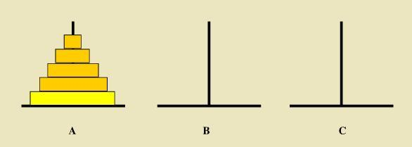

# <center>32. 汉诺塔、数组实现队列和双向队列<center>

具体代码请看：**[NDKPractice项目的datastructure32queue](https://github.com/EastUp/NDKPractice/tree/master/datastructure32queue)**

# 1. 汉诺塔：

如下图所示，从左到右有A、B、C三根柱子，其中A柱子上面有从小叠到大的n个圆盘，现要求将A柱子上的圆盘移到C柱子上去，
期间只有一个原则：一次只能移到一个盘子且大盘子不能在小盘子上面，求移动的步骤和移动的次数




步骤：
1. n-1个盘子借助 C 从 A 挪动到 B 上面
2. 直接把 n 盘子从 A 挪动到 C
3. n-1 个盘子借助A 从 B 挪动到 C

```c++
void hannuota(int n,char start,char help,char end){
    if(n == 1){
        LOGE("把第 %d 个盘子从 %c 挪动到 %c",n,start,end);
    }else{
        // 又是 n-1 汉诺塔
        hannuota(n-1,start,end,help);
        LOGE("把第 %d 个盘子从 %c 挪动到 %c",n,start,end);
        hannuota(n-1,help,start,end);
    }
}

hannuota(3,'A','B','C');
```

打印结果:

```
E/TAG: 把第 1 个盘子从 A 挪动到 C
E/TAG: 把第 2 个盘子从 A 挪动到 B
E/TAG: 把第 1 个盘子从 C 挪动到 B
E/TAG: 把第 3 个盘子从 A 挪动到 C
E/TAG: 把第 1 个盘子从 B 挪动到 A
E/TAG: 把第 2 个盘子从 B 挪动到 C
E/TAG: 把第 1 个盘子从 A 挪动到 C
```


# 2. 位运算知识：

负数转二进制 = 原码的补码

- 原码：`一个正数，按照绝对值大小转换成的二进制数；一个负数按照绝对值大小转换成的二进制数，然后最高位补1，称为原码。`

    比如 00000000 00000000 00000000 00000101 是 5的 原码；10000000 00000000 00000000 00000101 是 -5的 原码。 　

- 反码：`正数的反码与原码相同，负数的反码为对该数的原码除符号位外各位取反。`

    取反操作指：原为1，得0；原为0，得1。（1变0; 0变1）

    比如：正数00000000 00000000 00000000 00000101 的反码还是 00000000 00000000 00000000 00000101 ；

    负数10000000 00000000 00000000 00000101每一位取反（除符号位），得11111111 11111111 11111111 11111010。

    称：10000000 00000000 00000000 00000101 和 11111111 11111111 11111111 11111010互为反码。　

- 补码：`正数的补码与原码相同，负数的补码为对该数的原码除符号位外各位取反，然后在最后一位加1.`

    比如：10000000 00000000 00000000 00000101 的反码是：11111111 11111111 11111111 11111010。

    那么，补码为：

    11111111 11111111 11111111 11111010 + 1 = 11111111 11111111 11111111 11111011

    所以，-5 在计算机中表达为：11111111 11111111 11111111 11111011。转换为十六进制：0xFFFFFFFB。


# 3. 数组实现队列：

`cap` 可以乱传，以下代码，保证size 为 2 的 幂次

```c++

  // -1 二进制为：-1的源码的补码
head = (head - 1) & (size - 1); //(-1 & size -1  = size - 1) 这样head的取值才是：size-1,size-2,size-3

template <class E>
ArrayQueue<E>::ArrayQueue(int cap){
    // cap 可以乱传，以下代码保证是 2 的幂次
    int n = cap - 1;
    if(cap >= 2){
        n |= n >> 1;
        n |= n >> 2;
        n |= n >> 4;
        n |= n >> 8;
        n |= n >> 16;
    }
    n += 1;
    LOGE("size = %d",n);
    size = n;
    array = (E*)malloc(sizeof(E) * size);
    for (int i = 0; i < size; ++i) {
        array[i] = NULL;
    }
}
```

思想：`head，和tail`用来标记队列的头尾，`从尾部开始插入修改head，从尾部拿去修改tail`。

完整代码：

```c++
template <class E>
class ArrayQueue{
private:
    // 必须是 2 的幂次
    int size = 0;
    // 队列的头索引（是反向的添加，从 size - 1 ,size -2,...添加）
    int head = 0;
    // 队尾索引
    int tail = 0;
    // 数组地址
    E *array = NULL;
public:
    ArrayQueue();

    ArrayQueue(int size);

    ~ArrayQueue();

public:

    // 添加到队尾巴
    void enqueue(E e);

    // 移除队首的元素（指的是 tail的位置）
    E dequeue();

    // 获取队首的位置，但不移除
    E peek();

    bool isEmpty();

private:
    void growArray(); // 扩容数组

    void copyElement(E *src,int sPo, E *dest,int dPo,int len); // 拷贝数组元素到新的数组
};

template <class E>
ArrayQueue<E>::ArrayQueue():ArrayQueue(4){

}

template <class E>
ArrayQueue<E>::ArrayQueue(int cap){
    // cap 可以乱传，以下代码保证是 2 的幂次
    int n = cap - 1;
    if(cap >= 2){
        n |= n >> 1;
        n |= n >> 2;
        n |= n >> 4;
        n |= n >> 8;
        n |= n >> 16;
    }
    n += 1;
    LOGE("size = %d",n);
    size = n;
    array = (E*)malloc(sizeof(E) * size);
    for (int i = 0; i < size; ++i) {
        array[i] = NULL;
    }
}

template <class E>
ArrayQueue<E>::~ArrayQueue() {
    free(array);
}

template <class E>
void ArrayQueue<E>::enqueue(E e) {

    if(head == tail && array[head]!=NULL){ // 弹出的时候把对应的元素置为 NULL,这样好判断能否扩容
        LOGE("扩容了 head = %d,tail = %d",head,tail);
        // 扩容，双端队列，头部增加删除，也可以在尾部增加删除
        growArray();
    }

    // -1 二进制为：-1的源码的补码
    head = (head - 1) & (size - 1); //(-1 & size -1  = size - 1) 这样head的取值才是：size-1,size-2,size-3
    array[head] = e;
}

template <class E>
E ArrayQueue<E>::peek() {
    return array[(tail - 1) & (size - 1)];
}

template <class E>
E ArrayQueue<E>::dequeue() {
    tail = (tail - 1) & (size - 1);
    E value = array[tail];
    array[tail] = NULL; // 弹出去的元素置为 NULL;
    return value;
}

template <class E>
bool ArrayQueue<E>::isEmpty() {
    return head == tail && array[head]==NULL;
}


template <class E>
void ArrayQueue<E>::growArray() {
    int new_size = size << 1; // 扩容为原来的两倍

    E *new_array = (E*)malloc(sizeof(E) * new_size);

    // 对数据进行 copy, 将 tail 后面的拷贝到前面，将tail 前面的拷贝到后面
    int rightLen = size - tail;
    copyElement(array,tail,new_array,0,rightLen);
    copyElement(array,0,new_array,rightLen,tail);

    free(array);
    head = 0;
    tail = size;
    size = new_size;
    array = new_array;
}

template <class E>
void ArrayQueue<E>::copyElement(E *src, int sPo, E *dest, int dPo, int len) {
    for (int i = 0; i <len; ++i) {
        dest[dPo+i] = src[sPo+i];
    }
}

```


