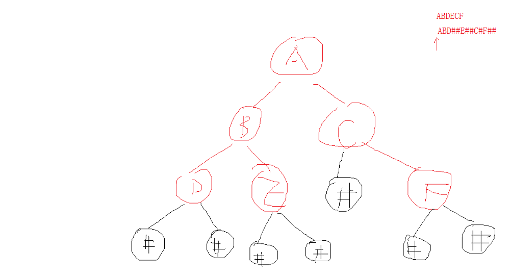

# <center>36. 二叉树序列化、优先级队列和堆排序<center>

具体代码请看：**[NDKPractice项目的datastructure36heapsorting](https://github.com/EastUp/NDKPractice/tree/master/datastructure36heapsorting)**


# 1. 二叉树的序列化和反序列化



## 1.1 序列化

```c++
/**
 * 序列化
 */
void serializeTree(TreeNode<char> *pNode, string &str) {
    if(!pNode){
        str.append("#");
        return;
    }

    // 先添加根节点
    str.append(string(1,pNode->data));

    // 再左节点
    serializeTree(pNode->left,str);

    // 再右节点
    serializeTree(pNode->right,str);

}
```

## 1.2 反序列化

```c++
/**
 * 反序列化 (ABD##E##C#F##)
 * 注意：必须要传 2 级指针，如果是一级指针这只是传过来的数组，++的时候是不会对数组有影响的
 */
TreeNode<char> *deserializeTree(char **str) {
    if(**str == '#'){
        *str += 1;
        return NULL;
    }

    TreeNode<char> *node = new TreeNode<char>(**str);
    *str += 1;

    // 解析左边的
    node->left = deserializeTree(str);
    // 解析右边的
    node->right = deserializeTree(str);

    return node;
}
```


# 2. 优先级队列

数组转二叉树规律(前提：`index 从 1 开始`)：

left(左节点) = 父节点角标 * 2  
right（右节点） = 父节点角标 * 2 + 1

- `最大堆`：父节点永远比子节点大。
- `最小堆`：父节点永远比子节点小。

```c++
template<class E>
class PriorityQueue {
    int count = 0; // 数组的大小，不够要扩容
    int index = 0; // 当前数组的角标位置
    E *array = NULL; // 数据数组

private:

    // 向上调整为大根堆
    void shiftUp(int index) {
        if(index > 1 && array[index] > array[index/2]){
            swap(array[index],array[index/2]);
            shiftUp(index/2);
        }
    }

    // 向下调整为大根堆
    void shiftDown(int k) {
        while (k * 2 <= index){ // 到底的情况
            int max = k*2; // 先假设左孩子是最大的
            if(max + 1 <= index && array[max] < array[max + 1]){
                max = max + 1; // 右孩子比左孩子大
            }

            // 因为没弹出之前就是大根堆，所以如果比子孩子最大的都还要大就不用排序了
            if(array[k] > array[max])
                break;

            // 交换，最大的往上冒
            swap(array[k],array[max]);

            k = max;
        }
    }

public:
    PriorityQueue(int count) : count(count) {
        array = new E[count];
    }

    bool isEmpty() {
        return index == 0;
    }

    E pop() {
        E max = array[1];
        // 把最后一个赋值到第一个
        array[1] = array[index];
        array[index] = NULL;
        index --;
        shiftDown(1);
        return max;
    }

    void push(E e){
        array[index + 1] = e;
        index ++;
        // 不断的调整堆
        shiftUp(index);
    }
};
```


# 3. 堆排序(升序采用大根堆，降序采用小根堆)

将一个数组想象成一棵完全二叉树：

如果把一个数组排成完全二叉树，则是下标循环时，是从上到下，`从左到右`,进行填充

1. `i`的左子节点下标：`2*i+1` ,如果越界，证明左孩子不存在
2. `i`的右子节点下标：`2*i+2`，如果越界，证明右孩子不存在
3. `i`的父节点下标：`(i-1)/2`,注意下标0位置求父节点，(0-1)/2 = 0
4. 第一个非叶子结点 `arr.length/2-1`

堆就是一棵完全二叉树。

- `最大堆`：父节点永远比子节点大。
- `最小堆`：父节点永远比子节点小。

- 思想是：`将待排序序列构造成一个大根堆，此时，整个序列的最大值就是堆顶的根节点。  
将其与末尾元素进行交换，此时末尾就为最大值。然后将剩余n-1个元素重新构造成一个大根堆，再将堆顶的根节点和最后一个元素n-1交换。如此反复执行，便能得到一个有序序列了`
- `时间复杂度`：**O(N&#42;$\log_2 N$)**
- `空间复杂度`：**O(1)**


```c++
/**
 * 调整为大根堆
 */
void adjuastHeap(int arr[],int k, int n){
    while ( k * 2 + 1 < n){ // 到底的情况
        // 先假设左孩子最大
        int max = k * 2 + 1;
        // 有右孩子且右孩子大于左孩子
        if(max + 1 < n && arr[max + 1] > arr[max]){
            max = max + 1;
        }

        if(arr[k] > arr[max]) // 左右两个孩子都比父亲小，不用调整了
            break;

        // 将最大的和父亲进行交换
        swap(arr[k],arr[max]);
        k = max; // 交换后接着往下调整
    }
}

/**
 *  堆排序
 */
void heapSort(int arr[],int len){
    // 1. 从最后一个不是叶子节点的节点（叶结点自然不用调整），开始调整为大根堆
    for(int i = len/2-1; i>=0; i--){
        adjuastHeap(arr,i,len);
    }

    // 2. 第一个与最后一个进行交换，最后一个值自然就是最大值了，接着把剩下的再进行大根堆排序
    for (int i = len - 1; i > 0; --i) {
        swap(arr[0],arr[i]);// 将最大的与末尾交换，这时末尾的就是最大值了
        adjuastHeap(arr,0,i); // 对 第 0 个位置进行调整。
    }
}

```


