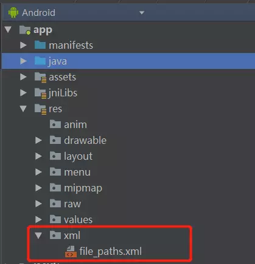

# <center>版本适配-Android7.0文件访问权限<center>
@[TOC](版本适配-Android7.0文件访问权限)

## 背景
        Android7.0 （N） 开始，将严格执行 `StrictMode` 模式，也就是说，将对安全做更严格的校验。而从 Android N 开始，将不允许在 App 间，使用 `file://` 的方式，传递一个 File ，否者会抛出 `FileUriExposedException`的错误，会直接引发 Crash。 

        但是，既然官方对文件的分享做了一个这么强硬的修改（直接抛出异常），实际上也提供了解决方案，那就是 `FileProvider`，通过 `content://`的模式替换掉 `file://`，同时，需要开发者主动升级 targetSdkVersion 到 24 才会执行此策略。
        

## 使用

### 1. 在AndroidMenifest中声明FileProvider

        为什么要声明呢？  
        因为FileProvider是ContentProvider子类  
        注意需要设置一个meta-data，里面指向一个xml文件。  
        具体如下：

```
<provider
    android:name="androidx.core.content.FileProvide"
    android:authorities="app的包名.fileProvider"
    android:grantUriPermissions="true"
    android:exported="false">
    <meta-data
        android:name="android.support.FILE_PROVIDER_PATHS"
        android:resource="@xml/file_paths" />
</provider>
```

- authorities：一个标识，在当前系统内必须是唯一值，一般用包名。
- exported：表示该 FileProvider 是否需要公开出去。<font color = red>如果设置为true,会报错：</font>  
`java.lang.RuntimeException: Unable to get provider androidx.core.content.FileProvider: java.lang.SecurityException: Provider must not be exported`
- granUriPermissions：是否允许授权文件的临时访问权限。这里需要，所以是 true。

### 2. resource目录下新建xml目录再创建file_paths.xml文件

**为什么要写这么个xml文件？**  
        因为要使用content://uri替代file://uri，那么，content://的uri如何定义呢？总不能使用文件路径。  
        所以，需要一个虚拟的路径对文件路径进行映射，所以需要编写个xml文件，通过path以及xml节点确定可访问的目录，通过name属性来映射真实的文件路径。



```
//每个节点都支持两个属性：name+path
//path：需要临时授权访问的路径（.代表所有路径） 
//name：就是你给这个访问路径起个名字
<?xml version="1.0" encoding="utf-8"?>
<paths xmlns:android="http://schemas.android.com/apk/res/android">
    <root-path name="root" path="" /> //代表设备的根目录new File("/");
    <files-path name="files" path="" /> //context.getFilesDir()
    <cache-path name="cache" path="" /> //context.getCacheDir()
    <external-path name="external" path="" /> //Environment.getExternalStorageDirectory()
    <external-files-path name="name" path="path" /> //context.getExternalFilesDirs()
     <external-cache-path name="name" path="path" /> //getExternalCacheDirs()
</paths>
```

比如

```
<?xml version="1.0" encoding="utf-8"?>
<paths>
 //代表的目录即为：Environment.getExternalStorageDirectory()/Android/data/包名/
    <external-path
        name="files_root"
        path="Android/data/包名/" />

 //代表的目录即为：Environment.getExternalStorageDirectory()
    <external-path
        name="external_storage_root"
        path="." />

 //代表的目录即为：Environment.getExternalStorageDirectory()/pics
    <external-path
        name="external"
        path="pics" />

</paths>
```

注意 `path= "."` 代表可以使用声明的该路径下所有的文件

### 3. 使用FileProvider

```
if (Build.VERSION.SDK_INT >= Build.VERSION_CODES.N) {
    Uri uri = FileProvider.getUriForFile(CameraActivity.this, "app的包名.fileProvider", photoFile);
} else {
    Uri uri = Uri.fromFile(photoFile);
}
```

注意：<font color=red>如果使用其他应用打开文件 FileProvider</font>

如果分享到其他应用，还需要进行授权。需要给目标应用添加读取 uri 的权限。

- 使用 Context.grantUriPermission(package, Uri, mode_flags) 给特定的应用包添加读写权限，mode_flags 包括 `FLAG_GRANT_READ_URI_PERMISSION` 和 `FLAG_GRANT_WRITE_URI_PERMISSION`，可以都添加，分别是读和写 Uri 的权限。授权期限到重启设备或者使用 revokeUriPermission() 取消权限为止。
- 除上面的方法之外，也可以使用在自己的要使用的 Intent 中加入这个权限，比如有一个 Intent 为 intent，调用 `intent.addFlags(Intent.FLAG_GRANT_READ_URI_PERMISSION); `则使用该 intent 的应该可以读取 uri，但下次还需要添加才行。

```
 Intent intent = new Intent("android.intent.action.VIEW");
            intent.addCategory("android.intent.category.DEFAULT");
            //Intent.FLAG_GRANT_READ_URI_PERMISSION | Intent.FLAG_GRANT_WRITE_URI_PERMISSION  给其它应用增加读写URI的权限
            intent.addFlags(Intent.FLAG_ACTIVITY_NEW_TASK|Intent.FLAG_GRANT_READ_URI_PERMISSION | Intent.FLAG_GRANT_WRITE_URI_PERMISSION);
            Uri uri;
            if(Build.VERSION.SDK_INT >= Build.VERSION_CODES.N){
                uri = FileProvider.getUriForFile(getContext(),"com.mediate.bvslite.fileProvider",file);
            }else
                uri = Uri.fromFile(file);
            intent.setDataAndType(uri, "application/pdf");
            startActivity(intent);
```


